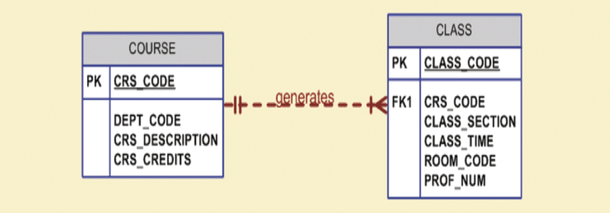
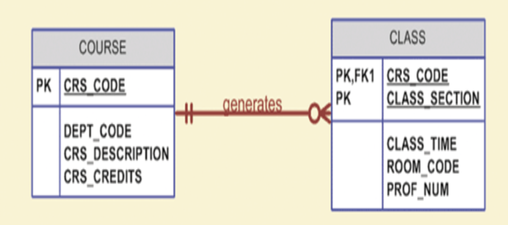
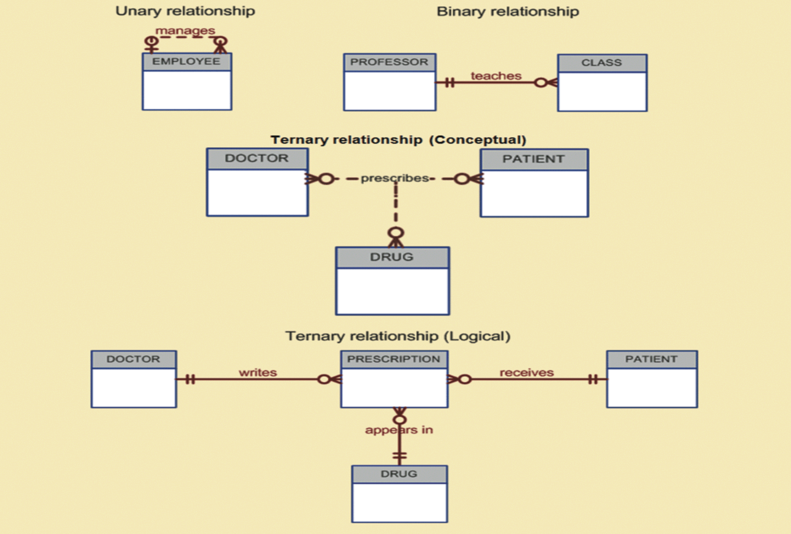

# Module 3: Entity Relationship (ER) Modeling

## ER Diagrams
ERD represents conceptual database as viewed by end user, and depicts the main components.

- *ERD main components:*
    – Entities: Rectangle with entity name, noun for name, written in all CAPS.
    – Attributes: Characteristics of the entities written in attribute box below entity rectangle and have a domain (i.e. set of possible values).
    – Relationships (Cardinality)

### Entities and their attributes

*Primary Keys*

Underlined in the ERD, PKs are ideally composed of only single attribute, but it is possible to use a composite PK.

*Composite v. Simple Attributes*

- Composite attribute can be subdivided
    – Address, phone number
- Simple attribute cannot be subdivided
    – Gender, marital status

*Single-valued v. Multivalued Attributes*

- Single-value attribute can have only one value
    – e.g. SSN
- Multivalued attributes can have many values
    – e.g. Car_Color (interior, exterior)
    – Should not implement them in relational DBMS
    – Car_color!Int_Color,Ext_Color

*Derived Attributes*
Derived Attributes are attribute whose value may be calculated (derived) from other attributes. The do not need to be physically stored within the DB, and can be derived by using an algorithm.

### Relationships

An association between entities that participate in a relationship. Relationships always operate in both directions. They are difficult to classify if only one side of the relationship is known.

#### Connectivity and Cardinality

*Connectivity* describes the relationship classification (1:1, 1:M, M:N). *Cardinality* expresses min and max number of entity occurrences associated with one occurrence of related entity. Both are established using business rules.

#### Relationship Strength

*Weak (non-identifying)* relationships exist if a PK of a related entity does not contain the PK component of parent entity.

*Strong (Identifying)* relationships exist when a PK of a related entity contains the PK component of parent entity.

The database designer usually decides whether or not to use a weak or strong relationship between entities when designing the ER model.

#### Relationship Degree

The degree indicates number of entities or participants associated with a relationship.

*Unary*: Association is within single entity; recursive

*Binary*: Two entities

*Ternary* Three entities

The following image shows examples of all three of these relationship degrees.

# ERD (Crows Feet) Cheat Sheet

Diagram to help build ERD.

