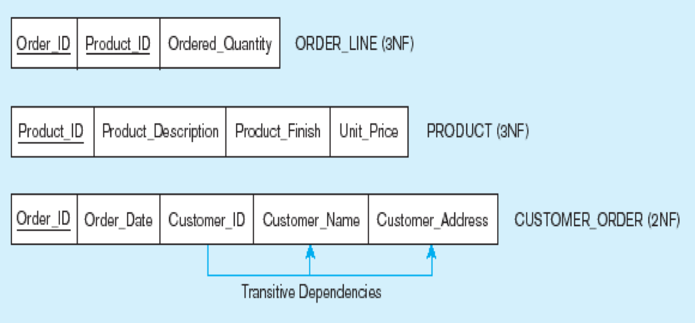

# Module 6 - Normalization

## What is normalization?
An exercise that removes data redundancy in database design.

__General rule of thumb:__ A table should not pertain to more than one entity type.

### Example

__Questions__

- Is this a Relation?
    - Yes, no multi-valued attributes, columns are uniquely named, no duplicate values.
- What's the primary key?
    - Composite: Emp-Id, Course-Title. Notice that Emp-ID, on its own, has duplicate values, which is why we need the composite.

#### Anomalies in the table

- Insertion: duplicate data will be generated when employee 100 takes a new course.
- Deletion: if we remove employee 140, we lose information about the existence of a Tax Acc class
- Modification: giving a raise to employee 100 forces us to update multiple records.

These anomalies exist because there are two themes (entity types) in this one relation. This results in data duplication and an unnecessary dependency between the entities.

### Functional Dependencies and Keys

__Functional Dependency:__

- The value of one attribute (the determinant) determines the value of another attribute.

__Candidate Key:__

- A unique identifier. One of the candidate keys will become the primary key
    - E.g. perhaps there is both credit card number and SS# in a table… then both are candidate key
- Each non-key attribute is functionally dependent on every candidate key

## 1NF, 2NF, 3NF

### 1NF

- No multivalued attributes
- Every attribute value is atomic
- "Fill in the blanks"

__All relations are in 1st Normal Form__

The following picture shows a table that is __not__ a relation, since there are multivalued attributes.

This table is a relation, but not a well-structured one

#### Anomalies in this 1NF table
- Insertion – if new product is ordered for order 1007 of existing customer, customer data must be re-entered, causing duplication
- Deletion – if we delete the Dining Table from Order 1006, we lose information concerning this item's finish and price
- Update – changing the price of product ID 4 requires update in several records

### 2NF

- 1NF __PLUS__ every non-key attribute is fully functionally dependent on the ENTIRE primary key
    - Every non-key attribute must be defined by the entire key, not by only part of the key
    - No partial functional dependencies

Here is a table _NOT_ in 2NF.

__To Convert to 2NF:__

- Create a new relation for each PK attribute that is a determinant in a partial dependency.  That attribute becomes the PK of the new relation.
- Move the non-key attributes dependent on the new PK to the new relation.

Here is a table that is in 2NF.

#### Anomalies in this 2NF table
Notice that partial dependencies are removed, but there are still __transitive dependencies.__

### 3NF

- 2NF __PLUS__ no transitive dependencies (functional dependencies on non-PK attributes)
    - Called transitive, because the PK is a determinant for another attribute, which in turn is a determinant for a third

__To Convert to 3NF:__
Non-key determinant with transitive dependencies goes into a new relation
It becomes PK in the new relation and stays as FK in the old relation

This table has transitive dependencies removed.

## Summary of steps to normalization

## Denormalization

It's important to note that normalization is the goal during the design process, but in production may cause issues, and in some cases tables that haven't been normalized are the best choice. Problems that could come up are...

- Number of DB tables expands in the normalization process
- Joining more tables takes additional I/O operations and processing logic, thereby reducing system speed
- Conflicts between design and performance goals are often resolved through compromises that include denormalization

Denormalization should be used after cautious consideration.

